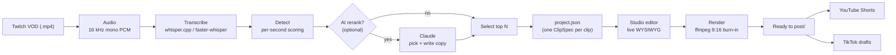

# ClipForge

**Turn a Twitch VOD into ready-to-post vertical clips — automatically, locally, and for free.**

ClipForge transcribes a stream on your own GPU, finds the most clippable moments, and renders each
as a 9:16 short (facecam on top, gameplay on the bottom, animated word-by-word captions, a follow
watermark, and a hook titlecard). A local **Studio** app lets you trim, restyle, and fine-tune every
clip with a live WYSIWYG preview — then post or schedule straight to **YouTube Shorts** and **TikTok**
without leaving the app. It also assembles long-form 16:9 YouTube videos from the same VOD.

The only optional paid piece is an Anthropic API key for AI title/caption writing and clip ranking;
everything else runs on your machine at no cost.

> Fully configurable — ClipForge ships with neutral defaults; set your own handle and persona in one
> local JSON file (see [Make it yours](#make-it-yours)). No accounts, paths, or keys are baked in.

---

## How it works



Full design notes: **[docs/ARCHITECTURE.md](docs/ARCHITECTURE.md)**.

---

## Features

- **Local transcription** on the GPU — whisper.cpp (Vulkan, great on AMD) or faster-whisper
  (CUDA on NVIDIA), with automatic backend selection and a CPU fallback. Transcripts are cached.
- **Automatic moment detection** — per-second scoring on six audio/text signals
  (energy, spike, sustain, talk-density, laughter, dynamics), tuned to favour real gameplay reactions
  over lobby chatter, snapped to sentence boundaries.
- **Optional AI pass** (Claude) — re-rank the shortlist, write per-platform titles/captions/hashtags,
  and apply plain-English edits. The whole pipeline works without it.
- **The Studio** — a native desktop window (no browser chrome) with a true live preview: add text,
  shapes, arrows, emojis, images, a chat inset, and a hook titlecard, and they appear instantly on the
  video. Trim, splice in more of the stream, restyle captions, approve, and batch-render.
- **One-click posting & scheduling** to YouTube Shorts and TikTok from inside the app.
- **Long-form** — assembles 20–90 min 16:9 YouTube videos (chapters, captions, descriptions) from the
  same VOD, into a separate folder.

---

## Requirements

- **Windows 10/11** (the app uses Windows launchers, a native WebView2 window, and `%USERPROFILE%` paths).
- **Python 3.11+** (3.13/3.14 recommended).
- **ffmpeg + ffprobe** on `PATH` (or installed via WinGet — `winget install Gyan.FFmpeg`).
- **A GPU is recommended** for fast transcription:
  - **NVIDIA** → CUDA via faster-whisper (installed by `setup.ps1`).
  - **AMD** → whisper.cpp with a Vulkan build (drop the prebuilt `whisper-cli` binary in
    `<clipforge-home>/whispercpp/` — see [docs/ARCHITECTURE.md](docs/ARCHITECTURE.md#transcription)).
  - **No GPU** → runs on CPU (much slower; fine for short clips/tests).
- Optional: an **Anthropic API key** for the AI features.

---

## Install

```powershell
git clone https://github.com/Brettillian123/clipforge.git
cd clipforge\clipper

# one-time setup: creates a local venv, installs deps, copies caption fonts, builds the watermark
powershell -ExecutionPolicy Bypass -File .\setup.ps1
```

`setup.ps1` creates everything under your **ClipForge home** (default `%USERPROFILE%\clipforge`) and
installs the Python dependencies from `requirements.txt`. If you have an NVIDIA GPU it also installs the
CUDA wheels.

Prefer to do it by hand?

```powershell
cd clipper
python -m venv "$env:USERPROFILE\clipforge\.venv"
& "$env:USERPROFILE\clipforge\.venv\Scripts\python.exe" -m pip install -r requirements.txt
```

---

## Run

**The Studio (recommended):**

```powershell
cd clipper
$env:PYTHONPATH = (Get-Location)
& "$env:USERPROFILE\clipforge\.venv\Scripts\python.exe" dashboard.py
```

…or just double-click **`clipper\ClipForge.bat`**. The Studio opens as its own desktop window.

1. Drop your stream recordings (`.mp4`) in your **Videos** folder (or point `CLIPFORGE_LIBRARY`
   elsewhere). They appear on the Home screen.
2. **🎬 Make clips** (or **🎞 Longform**) on a VOD. ClipForge transcribes, detects, and renders.
3. Review and fine-tune each clip in the editor.
4. **⬇ Download** a clip to render the final burned-in file, then **🚀 Post** it (see
   [Posting](#posting-to-youtube--tiktok)).

**From the command line** (one-off, no UI):

```powershell
$env:PYTHONPATH = (Get-Location)
& "$env:USERPROFILE\clipforge\.venv\Scripts\python.exe" clip.py "C:\path\to\your-vod.mp4" --ai
```

`clip.py` flags: `--count N` · `--ai` (Claude picks + writes copy) · `--limit-secs 900` (fast test on
the first 15 min) · `--dry-run` (detect only, no render) · `--dashboard` (render then open the Studio).

---

## Make it yours

ClipForge ships with neutral defaults. To personalise it **without editing any code**, drop a
`config.json` in your ClipForge home (`%USERPROFILE%\clipforge\config.json`). Any field from
[`pipeline/config.py`](clipper/pipeline/config.py) can be overridden:

```json
{
  "wm_handle": "yourhandle",
  "channel_name": "YourChannelName",
  "channel_persona": "a comedic gaming streamer",
  "clip_count": 12,
  "use_nvenc": true
}
```

- `wm_handle` — your Twitch @handle; shown in the follow watermark and the caption call-to-action.
- `channel_name` / `channel_persona` — used by the AI copywriter so titles/captions sound like you.
- …plus geometry, caption styling, detection weights, encoder choice, long-form settings, and more.

**Environment overrides:**

| Variable | Default | What |
|---|---|---|
| `CLIPFORGE_HOME` | `%USERPROFILE%\clipforge` | where the venv, models, cache, and `config.json` live |
| `CLIPFORGE_LIBRARY` | `%USERPROFILE%\Videos` | folder the Home picker scans for VODs + clip batches |
| `ANTHROPIC_API_KEY` | *(unset)* | enables AI features (or paste the key in the Studio header) |

---

## Posting to YouTube + TikTok

ClipForge can upload finished clips to your own channels and schedule them with a local timer.
It's **semi-automated and free**: YouTube uploads land **private** until you flip them public in
Studio (unverified API projects are locked private), and TikTok lands in your **drafts** (you add the
caption and tap Post in the app). Full hands-off public posting requires each platform's audit, which
needs a public website — out of scope for a free, local tool.

You connect your own developer apps once (Google Cloud + TikTok for Developers) and paste the client
keys into the Studio's **🚀 Posting** panel; OAuth runs through the app's own loopback redirect, so no
public site is needed for sign-in. Step-by-step setup is built into that panel and detailed in
[`clipper/README.md`](clipper/README.md#posting-setup).

---

## Repository layout

```
clipforge/
├─ README.md              ← you are here
├─ docs/
│  ├─ ARCHITECTURE.md     ← full architecture & data model
│  ├─ privacy.html        ← privacy policy (for the posting API app registrations)
│  └─ terms.html          ← terms of service
└─ clipper/
   ├─ dashboard.py        ← launches the Studio (native window)
   ├─ dashboard.html      ← the Studio UI (one vanilla-JS page)
   ├─ clip.py / longform.py / cfedit.py   ← CLI entry points
   ├─ ClipForge.bat / setup.ps1           ← Windows launcher + installer
   ├─ requirements.txt
   └─ pipeline/           ← the engine (see ARCHITECTURE.md)
      ├─ config.py        ← every tunable default (override via config.json)
      ├─ audio.py · transcribe.py · transcribe_whispercpp.py · detect.py
      ├─ rerank.py · ai_edit.py · meta.py        ← AI + metadata
      ├─ project.py · render.py · elements.py · captions.py · branding.py
      ├─ jobs.py · longform.py · camdetect.py
      ├─ server.py        ← stdlib HTTP server + JSON API for the Studio
      └─ posting.py       ← YouTube/TikTok OAuth, uploaders, scheduler
```

Heavy/private data lives **outside** the repo, under your ClipForge home: the venv, model cache,
transcript/work cache, API key (`secret.json`), posting tokens (`posting.json`), and your `config.json`.
Source VODs and rendered clips are never committed.

---

## Tech stack

Python (stdlib HTTP server, no web framework) · ffmpeg/libass for rendering · whisper.cpp (Vulkan) &
faster-whisper (CUDA) for transcription · Pillow + NumPy for frames/audio · pywebview (WebView2) for the
native window · vanilla JS for the editor · the Anthropic, Google API, and TikTok APIs for the optional
AI and posting features.

## License & disclaimer

A free, personal, open-source project. Provided as-is, with no warranty. Not affiliated with Twitch,
YouTube, Google, or TikTok. You are responsible for the content you upload and for complying with each
platform's terms.
