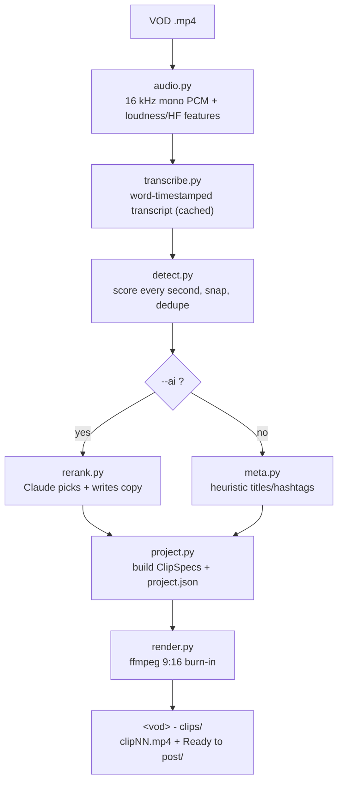

# ClipForge — Architecture

This document explains how ClipForge is put together: the pipeline stages, the data model, the
rendering model, the Studio app, and the posting system. It's aimed at someone reading the codebase
for the first time who wants the full picture.

- **Language/stack:** Python 3.11+, ffmpeg/libass, Pillow + NumPy, a stdlib HTTP server, vanilla JS,
  pywebview (WebView2). No web framework, no database.
- **Design principles:**
  1. **Local & free.** Everything runs on the user's machine. The only optional paid call is to the
     Anthropic API for AI copy/ranking.
  2. **Data is just numbers.** A clip is a JSON record of pixel coordinates, hex colours, and seconds.
     Any edit — by a human in the Studio, by the CLI, or by Claude — is a change to that data + a
     re-render. Nothing about a clip is hidden in binary state.
  3. **WYSIWYG.** The editor previews in the same 1080×1920 coordinate space the renderer uses, so what
     you see is what gets burned in.
  4. **Degrade gracefully.** No GPU → CPU. No AI key → deterministic heuristics. No posting libs → the
     rest of the app is unaffected.

---

## 1. Pipeline overview



A run is orchestrated by **`jobs.py`** (`make_clips`, `make_longform`), which is what both the CLI
(`clip.py`) and the Studio server call.

---

## 2. Module map (`clipper/pipeline/`)

| Module | Responsibility |
|---|---|
| `config.py` | Every tunable default in a `Config` dataclass; `load_config()` merges a user `config.json`. Path constants (`LOCAL_ROOT`, `WORK_DIR`, …). |
| `util.py` | ffmpeg/ffprobe discovery, subprocess helpers, atomic JSON read/write, font setup, the local API-key store, and a Windows tweak that suppresses child-process console windows. |
| `audio.py` | Decode to 16 kHz mono; compute per-frame loudness (dBFS) and high-frequency energy with NumPy (no librosa/torch). |
| `transcribe.py` | Backend selection + caching; word-timestamped transcript. |
| `transcribe_whispercpp.py` | whisper.cpp (Vulkan) backend for AMD GPUs. |
| `detect.py` | Score every second on six signals, snap to pauses, dedupe, return ranked candidates. |
| `rerank.py` | Optional Claude pass: re-rank the shortlist + write per-platform copy; `write_titles()` for an existing set. Prompts are built from `Config` (persona/handle). |
| `ai_edit.py` | Natural-language clip edits + AI caption cleanup. |
| `meta.py` | Heuristic (no-API) titles/captions/hashtags + game guessing. |
| `project.py` | The `ClipSpec` dataclass, `build_project()`, the titlecard element, and project.json load/save. |
| `elements.py` | Renders any overlay element (text/shape/emoji/image/chat) to a transparent PNG. |
| `captions.py` | Builds the ASS subtitle file for word-by-word karaoke captions. |
| `branding.py` | Generates the corner follow-watermark PNG. |
| `camdetect.py` | Finds the facecam's gold border per clip (so the crop tracks the real cam). |
| `render.py` | The ffmpeg render: layout, captions, element compositing, encoder selection + corruption guard. |
| `jobs.py` | End-to-end orchestration: `make_clips`, `make_longform`, `publish_clip`, output-folder helpers, the review filmstrip. |
| `longform.py` | Plans + renders long-form 16:9 session videos with chapters. |
| `server.py` | The Studio's stdlib HTTP server, JSON API, render-job manager, and native-window launcher. |
| `posting.py` | YouTube/TikTok OAuth, uploaders, and the upload scheduler. |

---

## 3. Data model

Each VOD's clips live in a sibling folder `"<vod-stem> - clips/"` containing **`project.json`** — one
record per clip — plus the rendered files. Long-form goes to `"<vod-stem> - longform/"`.

A clip record maps to a **`ClipSpec`** (`project.py`). The fields that define the *rendered* output:

- `segments` — `[{start, end, mute?}]` in **absolute VOD seconds**. One segment is a simple clip;
  multiple segments are concatenated (splice in context from elsewhere in the stream).
- `captions_enabled`, `caption_style`, `caption_words` — burned karaoke captions + per-clip overrides.
- `chat` — an optional live chat inset (source crop, position, size, on-screen window).
- `elements` — the overlay list (see §6): text, shapes, arrows, emojis, images, the hook titlecard.
- `cam`, `cam_mode` — facecam crop (auto-detected or manual).
- `metadata` — per-platform copy: `{tiktok:{title,caption,hashtags}, shorts:{…}}`.

Plus editor/runtime fields: `id`, `approved`, `notes`, render/export status, and `export_sig` (a hash
of the render-defining fields used to detect when the downloaded file is stale).

Coordinates are in **1080×1920 render space** (x: 0→1080 left→right, y: 0→1920 top→bottom; the
facecam/gameplay seam is at y≈768). Times are seconds; element `timing.start/end` are relative to the
clip, while `segments`/`chat.grab_t` are absolute VOD seconds.

---

## 4. Transcription

`transcribe.py` picks a backend from `cfg.transcribe_backend` (`auto` by default):

- **whisper.cpp (Vulkan)** — used when its binary is present in `<LOCAL_ROOT>/whispercpp/`. Ideal on
  AMD GPUs (no CUDA). Uses a `large-v3-turbo` ggml model with DTW word timing; a configurable
  `wcpp_word_lead_s` shift corrects whisper.cpp's consistent ~0.4 s onset lag so karaoke captions land
  in sync.
- **faster-whisper** — CUDA on NVIDIA, or CPU. `large-v3`, word timestamps, beam search.
- **CPU fallback** — slow but works anywhere.

Transcripts are **cached** keyed to the VOD, so re-running detection/render never re-transcribes. The
full transcript is the source for captions and the AI context window; per-clip caption fixes
re-transcribe just the clip slice for tight word timing.

---

## 5. Detection

`detect.py` scores the VOD on a 1-second grid using two parallel scan windows (a ~30 s "main" and a
~15 s "punchy"). Each window gets a weighted sum of six normalised components:

| Component | Signal |
|---|---|
| `E` energy | sustained loudness vs a robust speech baseline |
| `SP` spike | sudden +dB rise — the freak-out; the strongest highlight cue |
| `SUS` sustain | fraction of the window in the hype range |
| `TXT` text | lexicon hits + speech-rate + repetition + questions |
| `LAU` laugh | laughter tokens + a high-frequency-energy proxy |
| `VAR` variance | loudness dynamics (gameplay swings; lobby chatter is flat) |

Weights live in `config.py` (`w_energy`, `w_spike`, …) and are tuned to favour **reactions and real
gameplay** over talk-density, because raw talk-rate peaks during lobby/menu socialising. Candidate
boundaries snap to sentence/micro pauses (so clips never cut mid-word), overlapping picks are deduped
with a minimum spacing, and the top `keep_for_rerank` are kept for the optional AI pass.

---

## 6. The element system

Overlays are the spine of rendering. **Every** visual extra — the watermark, the chat inset, text,
shapes, arrows, emojis, images, and the hook titlecard — is an *element* with the same shape:

```jsonc
{ "id": "e1", "type": "text", "z": 50, "seg_index": 0, "visible": true,
  "geom":  { "x": 70, "y": 410, "w": 940, "h": null },     // 1080×1920 render space
  "timing":{ "start": 0.0, "end": 3.0, "fadeIn": 0.0, "fadeOut": 0.3 },
  "style": { "size": 74, "color": "FFFFFF", "outline": 8, "bg": "0B0912", "bgAlpha": 0.52 },
  "data":  { "text": "WATCH WHAT HAPPENS" } }
```

`elements.py` turns each into a transparent PNG (Pillow); `render.py` composites them with fade in/out.
Because the Studio stage uses the *same* coordinate space, the on-screen preview is a faithful WYSIWYG
of the burned-in output. The hook **titlecard** is just a seeded text element over the first
`titlecard_secs` seconds, so it's fully editable/movable/removable like any other element, and it lands
on the auto-generated cover frame.

---

## 7. Rendering

`render.py` builds **one ffmpeg invocation per segment**:

1. **Layout** — crop the facecam from the source and scale it to the top panel (0–768); crop gameplay
   to the bottom panel (768–1920); draw the gold/lavender seam divider. The facecam crop comes from
   `camdetect.py` (per-clip gold-border detection) or a manual box.
2. **Captions** — `captions.py` emits an ASS file; libass burns word-by-word karaoke with an active-word
   highlight.
3. **Overlays** — the watermark, chat inset, and every element are composited as PNGs with fades.
4. Multi-segment clips render each part then concat.

**Encoder selection + corruption guard.** ClipForge prefers a hardware encoder (NVENC, or AMD AMF) and
falls back to libx264. AMD's AMF encoder can, under GPU contention, silently emit a *corrupt* H.264
file — exit code 0, full file size, scrambled frames. So after a hardware encode the output is
**decode-verified** (`_decode_ok`): if ffmpeg reports decode errors, ClipForge flips a process-wide
`_FORCE_CPU` flag and re-renders on libx264. This is why a clean clip can quietly cost a little more CPU
after a bad GPU encode — correctness over speed.

**Base vs. export — the key rendering subtlety.** Each clip has two renders:

- **`clipNN.mp4`** — the **base**: rendered *without* overlays. The Studio plays this and draws the
  elements (titlecard, text, chat, …) live as HTML on top. If the base had overlays baked in, they'd
  appear **doubled** in the editor.
- **`clipNN.export.mp4`** — the **export**: the full burn-in (captions + every overlay). This is what
  `publish_clip()` copies into the clean **`Ready to post/`** folder as `clipNN.mp4`, alongside a
  `clipNN.jpg` cover (the first frame, so the posted thumbnail matches what the clip opens on).

`server.py` tracks an `export_sig` (hash of the render-defining fields). When your edits change that
hash, the Studio shows an "edits not downloaded" badge until you re-export.

---

## 8. The Studio (server + UI)

```mermaid
flowchart LR
  subgraph Desktop window (pywebview / WebView2)
    UI["dashboard.html<br/>vanilla JS, live stage"]
  end
  UI <-->|"HTTP + JSON on 127.0.0.1:8765"| SRV["server.py<br/>stdlib ThreadingHTTPServer"]
  SRV --> ST["State<br/>project + jobs (RLock)"]
  SRV -->|range requests| MP4["clipNN.mp4 (base)"]
  SRV --> RJ["render jobs<br/>(render_lock, daemon threads)"]
  SRV --> POST["posting.py scheduler"]
```

- **`server.py`** is a dependency-free `ThreadingHTTPServer`. It serves the UI, streams clip mp4s with
  HTTP range support (so the browser can scrub without loading the whole file), and exposes a small JSON
  API: edit a spec, trigger a render, run an AI edit, grab chat/frame previews, manage jobs, store the
  API key, and drive posting.
- **State & concurrency.** A single `State` holds the loaded project and a `jobs` dict. A re-entrant
  `lock` guards every read-modify-write of the project (which is saved atomically), and a separate
  `render_lock` **serialises ffmpeg** so only one render runs at a time. Each render/job runs on its own
  daemon thread; a newer render of the same clip supersedes (cancels) an in-flight one.
- **`dashboard.html`** is one vanilla-JS page. The stage plays the base clip and draws elements as
  positioned HTML; edits autosave per clip (debounced) and re-render the base only when geometry/timing
  changes. The left rail is the clip browser; the right rail is the property/section panels (Element,
  Length/parts, Layers, Chat, Captions, Post/schedule, AI assist).
- **Native window.** `dashboard.py` launches via pywebview over the Windows WebView2 runtime, so
  ClipForge appears as its own taskbar app (own icon + AppUserModelID), not a browser tab. It degrades:
  native window → chrome-less Edge/Chrome `--app` → a normal browser tab.

---

## 9. Posting & scheduling (`posting.py`)

Finished clips can be uploaded to YouTube Shorts and TikTok from the Studio.

- **OAuth via the app's own server.** The consent page opens in the user's real browser (platforms
  block embedded webviews); the redirect target is the app's own loopback URL
  (`http://127.0.0.1:8765/oauth2/<platform>/callback`), so **no public website is needed** for sign-in.
  Tokens, client creds, and the upload queue live in `<LOCAL_ROOT>/posting.json` (local only).
- **Uploaders.** YouTube uses the Data API v3 resumable `videos.insert` (+ `thumbnails.set`); TikTok
  uses the Content Posting API's draft/inbox endpoint (init → chunked `FILE_UPLOAD` → status poll).
- **Scheduler.** A daemon thread polls a persisted queue and fires due uploads (interrupted uploads are
  re-queued on restart). "Post now" wakes it immediately; scheduled posts fire at their time while the
  app is running.
- **The semi-automated reality** (free/local constraint): an unverified YouTube API project force-locks
  uploads to **private** (you flip to public in Studio), and TikTok's free path lands clips in your
  **drafts** (you add the caption and tap Post in-app). Fully hands-off public posting requires each
  platform's audit, which needs a public website.

---

## 10. Long-form (`longform.py`)

From the same transcript + loudness map, ClipForge segments the VOD into 20–90 min session blocks
(splitting on long dead stretches, merging short ones), generates chapter markers and a paste-ready
title/description/tags, renders each as a 16:9 video with optional captions and watermark, and writes a
manifest + review sheet to `"<vod-stem> - longform/"`. It reuses the same job/cancel infrastructure as
the clip renderer but is otherwise independent.

---

## 11. Configuration & file layout

- **Defaults** live in `pipeline/config.py` (`Config` dataclass). **`load_config()`** merges an optional
  `<LOCAL_ROOT>/config.json`, so users override anything (handle, persona, geometry, weights, encoder)
  without touching code. CLI flags override the most common ones at runtime.
- **ClipForge home** (`LOCAL_ROOT`, default `%USERPROFILE%\clipforge`, override with `CLIPFORGE_HOME`):

  ```
  clipforge/
  ├─ .venv/            Python environment
  ├─ work/             16 kHz wavs, cached transcripts, preview frames, per-clip ASS
  ├─ models/           whisper model cache (ggml / faster-whisper)
  ├─ whispercpp/       prebuilt whisper.cpp (Vulkan) binary + DLLs (AMD path)
  ├─ fonts/            Poppins TTFs copied for libass
  ├─ emoji/            Twemoji PNGs for the editor + renderer
  ├─ config.json       your overrides (handle, persona, …)   ← optional
  ├─ secret.json       Anthropic API key                      ← local only
  └─ posting.json      YouTube/TikTok tokens + upload queue    ← local only
  ```

- **Per-VOD output** sits next to the VOD: `"<stem> - clips/"` (clips + `project.json` +
  `Ready to post/`) and `"<stem> - longform/"`. Source VODs, rendered clips, secrets, and caches are all
  kept out of version control.

---

## 12. Notable design decisions

- **Base-vs-export split** prevents the doubled-overlay bug and keeps the editor a true live preview.
- **Decode-verify + CPU fallback** defends against AMD AMF silently emitting corrupt H.264.
- **Stdlib-only server + vanilla JS** keeps the Studio dependency-light and easy to run offline.
- **Everything-is-an-element** unifies the renderer and the editor on one coordinate space and one PNG
  compositing path.
- **Config-by-JSON-override** makes the public defaults neutral while letting each user personalise
  without forking the code.
